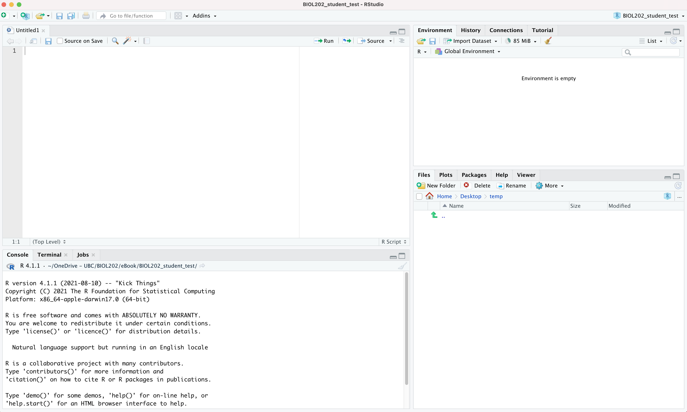
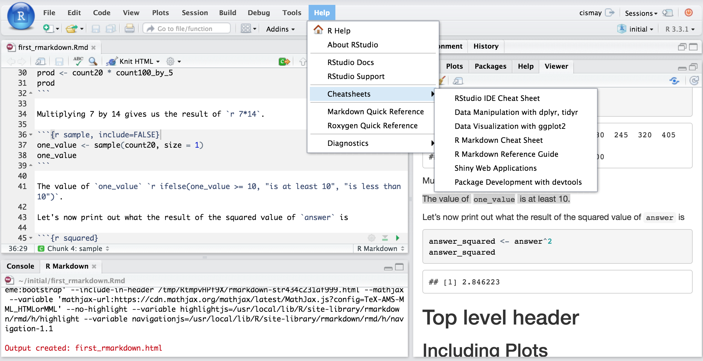

# What are R and RStudio? {#what_is_R}

It is assumed that you are using <a href="https://ubco-biology.github.io/Procedures-and-Guidelines/glossary#R">R</a> via RStudio. First time users often confuse the two. At its simplest:

* R is like a car's engine
* RStudio is like a car's dashboard.

```{r fig-01-r-engine, fig.cap = "R: Engine", echo = FALSE, out.width = "30%"}

```

```{r fig-01-rstudio-dashboard, fig.cap = "RStudio: Dashboard", echo = FALSE, out.width = "20%"}

```

More precisely, R is a programming language that runs computations while RStudio is an *integrated development environment (IDE)* that provides an interface by adding many convenient features and tools. So the way of having access to a speedometer, rearview mirrors, and a navigation system makes driving much easier, using RStudio's interface makes using R much easier as well.

## Installing R and RStudio {#install_R_Rstudio}

::: {.callout-note}
At the beginning of term, check the [R website](https://cran.r-project.org) for the current version of R, and update to it if you're not already on it. Once you've started into the tutorials, it is recommended that you NOT update again until after term is complete. This is to avoid any unforeseen problems introduced by the update.  **However**, if you have an older operating system on your computer, you'll want to check compatibility of both R and RStudio before updating.

RStudio is now owned by "posit", and its website (posit.co) should detect your operating system and provide the appropriate download option automatically.  The website with older versions of R is [here](https://cran.r-project.org/bin/macosx/), and older versions of RStudio is [here](https://docs.posit.co/previous-versions/rstudio/).
:::

Follow the instructions below to download and install both R and RStudio.

::: {.callout-note}
R needs to be installed successfully >prior< to installing RStudio (because the latter depends on the former)
:::

* Figure out what operating system (and version) you have on your computer. Windows versions are identified by a single number (e.g. "Windows 11"); macOS versions have both a number and a name (e.g. "macOS 14, Sonoma"). If you're not sure, check Settings > System > About on Windows, or the Apple menu > About This Mac on a Mac.
* Go to this [website](https://cran.r-project.org/) and click on the appropriate download link at the top of the page (depending on your operating system, Windows / MacOS / Linux)
    - For *Windows* users, download the "base" version; the file will be named `R-x.y.z-win.exe`, where `x.y.z` is whatever the current version number is (e.g. `R-4.5.1-win.exe`). Executing this file launches a familiar Windows Setup Wizard that will install R on your computer.
    - For *Mac* users, download the "pkg" file that is appropriate for your version of MacOS; the file will be named `R-x.y.z.pkg` (e.g. `R-4.5.1.pkg`). Download and run this installation package—just accept the default options and you will be ready to go.

* Now to install RStudio: once you have installed "R", go to this [website](https://docs.posit.co/ide/user/#rstudio-ide-oss-downloads) and click on the  "download RStudio desktop" button under the "Install RStudio" heading.  The website should detect what operating system you're using and offer you the appropriate version.

## Troubleshooting: what to do when something breaks {#troubleshooting}

Things will go wrong. You will run a line of code and instead of a plot or a table, you'll get a wall of red text. This is completely normal: it happens to experienced R users every single day, and learning *how to work through it yourself* is one of the most valuable skills you'll build in this course. Here's a simple order of operations to follow.

### Step 1: Read the error message {.unnumbered}

R usually tells you exactly which line the problem is on, and often what's wrong (a missing comma, a misspelled object name, a package that isn't loaded). Before doing anything else, read the message and look at that line. Half the time the fix is obvious once you actually read it rather than skimming past it.

### Step 2: Check the course's own troubleshooting page {.unnumbered}

Many of the errors you'll hit in this course are already documented, with fixes, in [Common errors and their solutions](99-common-issues.qmd). This is course-specific, so it's worth checking *before* searching more broadly: it's the fastest way to find a fix that's known to actually work with the exact setup we use.

### Step 3: Google it {.unnumbered}

If your error isn't listed there, copy the exact error text and paste it into Google, adding the word "R" to your search (for example: `Error in geom_point() could not find function R`).

This works well because R is one of the most widely used programming languages in the world, especially in science, so almost every error you'll encounter as a beginner has already been asked and answered, usually on a site called Stack Overflow, a question-and-answer forum for coding problems. You'll often find your exact error, explained, on the first page of results.

::: {.callout-tip}
## A plain search is enough — you don't need Google's "AI mode"

Google now offers an "AI mode" that generates a written answer instead of just listing links. You don't need to use it here. A regular search, with the ordinary list of links, is enough to find your error explained on a forum, and it gets you there without the extra computing cost of generating a new AI answer (more on that below). Stick with a normal search.
:::

::: {.callout-important}
## Why start with Google instead of an AI chatbot?

You may be tempted to paste your error into an AI chatbot like Claude or ChatGPT instead. For most of the errors you'll hit in this course (e.g. typos, a missing package, an unmatched bracket, a misspelled column name) a plain Google search is just as fast, and often faster, because someone has almost always already answered that exact question online. Google is also simply asking a search engine to look up something that already exists; a chatbot is generating a new response from scratch each time, which takes meaningfully more computing power (and electricity) to produce than a search-engine lookup does. For a common, simple error, that extra cost buys you nothing you couldn't get for free from a search.

There's also a more practical reason to build the Google-first habit: **you will not have access to any AI tool during your lab test.** If you lean on a chatbot every time something breaks now, you won't have that option when it counts, and you also won't have practiced the skill of reading an error and tracking down the fix yourself. If you lean on the troubleshooting page and Google and your own reasoning now, all of that will already be second nature by test day.

None of this means AI tools are off-limits. See below for how to use one well, if you choose to.
:::

### Step 4: Ask on the course discussion board {.unnumbered}

If you've read the error, checked the troubleshooting page, and searched it, and you're still stuck, post your question on Piazza. Include the exact error message and a copy of the code that produced it. Chances are good a classmate has encountered the same error and can help, or the instructor/TA will.

### When AI tools are useful {#ai_tools_useful}

If you do want to use an AI tool (Claude, ChatGPT, or similar), these tools can be genuinely useful for *understanding* code, not just fixing it, and every legitimate use here is free, so no one needs a paid subscription or a paid add-on to keep up in this course.

You may notice RStudio has a built-in "Posit Assistant" button offering to help with exactly this kind of problem. **Don't rely on it**; it requires a paid subscription to use. The free tools described here (the troubleshooting page, Google, and the free tiers of tools like Claude or ChatGPT) are all you need.

Used appropriately, an AI chatbot can:

* explain what a specific line of code or error message means, in plain language
* explain the general *idea* behind a statistical test or a function, so you can go apply it yourself
* help you understand *why* a fix works, once you already have a candidate fix from the troubleshooting page or Google

Used inappropriately, it is unethical, and/or becomes a shortcut that skips the learning:

* pasting in your whole assignment and asking it to "fix this" or "write the code for me"
* copying and pasting a chatbot's code straight into your R Markdown document without reading or understanding it
* asking it to answer a question you could look up in two minutes on Google

A good test to apply: after using the tool, could you explain the fix to a classmate, in your own words, without looking back at the chat? If not, you've been given an answer rather than an understanding, and that answer won't be there for you on the lab test.

For more guidance on using generative AI tools responsibly and effectively in your coursework, see UBC's [Learning with generative AI](https://academicintegrity.ubc.ca/genai/) resource.

## Start using R & RStudio {#start_r}

Recall our car analogy from a [previous tutorial](#what_is_R). Much as we don't drive a car by interacting directly with the engine but rather by using elements on the car's dashboard, we won't be using R directly but rather we will use RStudio's interface. After you install R and RStudio on your computer, you'll have two new programs AKA applications you can open. We will always work in RStudio and not R. In other words:

```{r fig-01-r-do-not-open, fig.cap = "R: DO NOT OPEN THIS", echo = FALSE, out.width = "30%"}

```

```{r fig-01-rstudio-open-this, fig.cap = "RStudio: OPEN THIS", echo = FALSE, out.width = "30%"}

```

Launch RStudio on your computer to make sure it's working (it loads R for you in the background).

### The RStudio Interface {#Rstudio_interface}

When you open RStudio, you should see something similar to the following:



Note the four panes which are four panels dividing the screen: the source pane (top left), console pane (bottom left), the files pane (bottom right), and the environment pane (top right). Over the course of this chapter, you’ll come to learn what purpose each of these panes serves.

### Coding basics {#coding_basics}

Please go through section [1.2 of the ModernDive online text](https://moderndive.com/1-getting-started.html#code) called "How do I code in R?". This should take about **15 minutes**.

You may get overwhelmed by all the terminology on that page... don't worry!  You can simply bookmark that page for future reference. But it does cover the coding basics very well!

### R packages {#packages}

An R package is a collection of functions, data, and documentation that extends the capabilities of R. They are written by a world-wide community of R users. For example, among the most popular packages are:

* `ggplot2` package for data visualization
* `dplyr` package for data wrangling
* `readr` package for reading data files into R

In this course we load packages **one at a time**, by name, as in the examples above. You may see other resources load a bundle called `tidyverse`, which loads `ggplot2`, `dplyr`, `readr` and several others in one line. We deliberately do not do that here: loading packages individually means you can always tell which package a function came from, and when something goes wrong the error message points somewhere you can actually look.

There are two key things to remember about R packages:

* *Installation*: Most packages are not installed by default when you install R and RStudio. You need to install a package before you can use it. Once you've installed it, you likely don't need to install it again unless you want to update it to a newer version of the package.

* *Loading*: Packages are not loaded automatically when you open RStudio. You need to load them everytime you open RStudio.

### Package installation {#package_install}

Let's install the `dplyr` package, as an example of how installing works.

::: {.callout-note}
In practice you will have installed almost everything already, in one step, by installing the course's `biol202` package — see [The `biol202` package](#biol202_package) below. Installing `biol202` also installs `dplyr`, `ggplot2`, `readr` and every other package the course uses. This section is here so you know *how* installation works, and can install something new when you need it.
:::

There are two ways to install an R package:

- In the Files pane:
    + Click on "Packages"
    + Click on "Install"
    + Type the name of the package under "Packages (separate multiple with space or comma):" In this case, type `dplyr`
    + Click "Install"

- Alternatively, in the Console pane type the following

::: {.callout-warning}
Later, when you start using R Markdown, never include the following "install.packages" code within your R Markdown document; only install packages by typing directly in the Console! (See [Common errors and their solutions](99-common-issues.qmd) for the specific errors this causes if you forget.)
:::

```{r, eval=FALSE}
install.packages("dplyr")
```

If you are attempting to install a package (using `install.packages`) and you get this message:

```
There is a binary version available but the source version is later:
  binary source needs_compilation
systemfonts  1.0.2  1.0.3              TRUE

Do you want to install from sources the package which needs compilation? (Yes/no/cancel)
```

Respond with "no" (without quotes).  Do NOT respond "Yes". (This same message and fix are also listed in [Common errors and their solutions](99-common-issues.qmd).)


::: {.callout-note}
When working on your own computer, you only need to install a package once, unless you want to update an already installed package to the latest version (something you might do every 6 months or so). **HOWEVER**: If you're working on a school computer (in a computer lab or in the library), you may need to install packages each session, because local files (on the computer) are automatically deleted daily. If you're unsure what packages are already installed, consult the "packages" tab in the lower-right RStudio pane when you start up RStudio; installed packages are listed there.
:::


### Package loading {#package_load}

Let's load the packages we will use most often.

After you've installed a package, you can load it using the `library()` command. Run the following code in the Console pane — one `library()` line per package, which is the convention we follow all term:

```{r, eval=FALSE}
library(dplyr)
library(ggplot2)
library(readr)
```

::: {.callout-note}
When you run `library(dplyr)`, you'll likely see a chunk of text like this appear:

```
Attaching package: 'dplyr'

The following objects are masked from 'package:stats':

    filter, lag

The following objects are masked from 'package:base':

    intersect, setdiff, setequal, union
```

This is **not an error**. It is `dplyr` telling you that it has some functions with the same name as functions already built into R (here, `filter` and `lag`), and that when you type `filter` or `lag`, R will now use the `dplyr` version rather than the built-in one. You'll see similar "masked" or "conflicts" messages whenever you load many other packages this term (`car`, `janitor`, and others). It is expected, and you can ignore it.
:::

::: {.callout-note}
You have to reload each package you want to use every time you open a new session of RStudio.  This is a little annoying to get used to and will be your most common error as you begin.  When you see an error such as

```
Error: could not find function
```

remember that this likely comes from you trying to use a function in a package that has not been loaded.  Remember to run the `library()` function with the appropriate package to fix this error. (See also [Common errors and their solutions](99-common-issues.qmd).)
:::

## The `biol202` package {#biol202_package}

Now that you know how R packages work in general, let's install the one package this whole course relies on: `biol202`.

Everything else (every dataset and every other package used anywhere in these tutorials) comes from this single package. Install it once, at the start of term, and you are done.

First, install the `remotes` package, which knows how to install packages from GitHub. Run this in the **Console** (the bottom-left pane in RStudio):

```{r}
#| eval: false
install.packages("remotes")
```

Then install the course package:

```{r}
#| eval: false
remotes::install_github("ubco-biology/biol202_ubco@v2026.1")
```

The `@v2026.1` at the end ensures that you are using the correct version of the package for the given
term. It will keep installing the same version even if the package is updated later for
a future term. This makes sure everyone in BIOL 202 this term is running
identical package versions.

::: {.callout-warning}
## What to expect during this install

**This can take several minutes the first time** — it also installs every other package the course uses, not just `biol202` itself. Nothing is wrong if it seems to sit there for a while; just let it finish.

While it's running, you may also see a message asking:

```
These packages have more recent versions available.
It is recommended to update all of them.
Which would you like to update?

1: All
2: CRAN packages only
3: None
```

Type **3** (None) and press Enter. Updating packages mid-term can take a long time and occasionally breaks something else — everyone in the course should be running the same package versions, so leave this for another day.

If you are on a **Windows** computer, you may also see a message about installing "Rtools" in order to build packages from source. You do **not** need Rtools for this install `biol202` does not require it. It is safe to ignore that message and let the install continue.
:::

::: {.callout-note}
## Only install once

`install.packages()` and `install_github()` install a package onto your computer permanently. You do **not** re-run them every session, and you should never put them inside an R Markdown document — if you do, your document will try to re-install packages every time you knit it.

Loading a package with `library()` is something different, and it's the thing you do every session — as you already saw in [Package loading](#package_load) above.
:::

### Check that it worked {.unnumbered}

Run this in the Console:

```{r}
#| eval: false
library(biol202)
data(birds)
birds
```

If you see a small table of bird types, you are ready.

### How the `biol202` data work {#biol202_data_overview}

Now that the `biol202` package is installed, here's how the datasets inside it work.

Every dataset used in these tutorials comes with the `biol202` package. To use one, load the package and then call `data()` with the dataset's name:

```{r}
#| eval: false
library(biol202)
data(circadian)
```

::: {.callout-note}
`library(biol202)` does **not** load `dplyr` or `ggplot2` for you. Installing `biol202` *installs* them; you still *load* the ones you need, yourself, at the top of each document, the way you learned above.
:::

Each dataset also has a help page describing every variable, its units, and where the data came from. To read it, put a question mark in front of the name:

```{r}
#| eval: false
?circadian
```

**Read the help page before you analyze a dataset.** It tells you what the variables mean, which is not something you can guess from the numbers. To see all the datasets available:

```{r}
#| eval: false
data(package = "biol202")
```


## Intro to R Markdown {#intro_markdown}

As you may have learned already from relevant section in the [Biology Procedures and Guidelines resource ](https://ubco-biology.github.io/Procedures-and-Guidelines/markdown-1.html), R <a href="https://ubco-biology.github.io/Procedures-and-Guidelines/glossary#Markdown">Markdown</a> is a markup language that provides an easy way to produce a rich, fully-documented reproducible analysis.  It allows its user to share a single file that contains all of the commentary, R code, and <a href="https://ubco-biology.github.io/Procedures-and-Guidelines/glossary#Metadata">metadata</a> needed to reproduce the analysis from beginning to end.  R Markdown allows for "chunks" of R code to be included along with Markdown text to produce a nicely formatted HTML, PDF, or Word file without having to know any complicated programming languages or having to fuss with getting the formatting just right in a Microsoft Word DOCX file.

One R Markdown file can generate a variety of different formats and all of this is done in a single text file with a few bits of formatting.  You'll be pleasantly surprised at how easy it is to write an R Markdown document after your first few attempts.

We will be using R Markdown to create reproducible lab reports.

::: {.callout-note}
R Markdown is just one flavour of a markup language. RStudio can be used to edit R Markdown. There are many other markdown editors out there, but using RStudio is good for our purposes.
:::

### Literate programming with R Markdown {#lit_programming}

::: {.callout-caution title="Activity"}
View the following short video:

[**Why use R Markdown for Lab Reports?**](https://youtu.be/lNWVQ2oxNho)
<iframe width="560" height="315" src="https://www.youtube.com/embed/lNWVQ2oxNho" frameborder="0" allowfullscreen></iframe>
:::

The preceding video described what can be referred to as <a href="https://ubco-biology.github.io/Procedures-and-Guidelines/glossary#Literate-programming">**literate programming**</a>: authoring a single document that integrates data analysis (executable code) with textual documentation, linking data, code, and text. In R Markdown, the executable R code is placed in "chunks", and these are embedded throughout sections of regular text.

For an example of a PDF document that illustrates literate programming, see [here](https://osf.io/59j4b).  It accompanied a lab-based experiment examining the potential for freshwater diatoms to be successfully dispersed over long distances adhered to duck feathers.

::: {.callout-caution title="Activity"}
View the following [youtube video](https://www.youtube.com/watch?v=asHhuHRxhvo) on creating an R Markdown document.
:::

### Making sure R Markdown knits to PDF {#veryify_knit}

Now we're going to ensure R Markdown works the way we want.  A key functionality we need is being able to "knit" our report to PDF format.

With the newest versions of RStudio, you may be able to knit to PDF without doing anything special first.

Let's give this a try:

Step 1: While in RStudio, select the "+" dropdown icon at top left of RStudio window, and select R Markdown. RStudio may at this point install a bunch of things, and if so that's ok.  It may also ask you to install the `rmarkdown` package.. if it does, do so (refer to the previous [tutorial](01-getting-started.qmd#package_install) on installing packages for help)!

Step 2: A window will then appear and you can replace the "Untitled" with something like "Test", then select OK.

Step 3: This will open an R Markdown document in the top left panel.  Don't worry about all the text in there at this point. What we want to do is test whether it will "knit" (render) the document to PDF format.

Step 4: Select the "Knit" drop-down icon at the top of the RStudio window, and select "Knit to PDF". RStudio will ask you to first save the markdown file (save it anywhere with any name for now), then it will process the markdown file and render it to PDF.

If this worked, great!!  You can ignore the next section here.  If it didn't work, then proceed to this next section:

If the preceding steps did not result in you being able to knit your markdown document to PDF, then do this:

Install the `tinytex` package by typing this code into the command console of RStudio:

```
install.packages("tinytex")
```

Then, once that has installed successfully, type the following:

```
tinytex::install_tinytex()
```

RStudio will take a minute or two to install a bunch of things. Once it's done, we're ready to try knitting to PDF.

::: {.callout-note}
Recall you only need to install a package once!  And this should be the last time you need to deal with the `tinytex` package (you won't need to "load" it in future), because now that it's installed, its functionality works in the background with RStudio.
:::

Now go back to the steps 1 through 4 above to try knitting your markdown document to PDF.

If you're still stuck, see [Common errors and their solutions](99-common-issues.qmd) for more troubleshooting options.

In a future [tutorial](02-reproducible-r.qmd#repro_research) we'll discuss how to use R Markdown as part of a reproducible workflow.

## Extra help {#r_resources}

If you are googling for R code, make sure to also include package names in your search query (if you are using a specific package). For example, instead of googling "scatterplot in R", google "scatterplot in R with ggplot2".

Rstudio provides links to several **cheatsheets** that will come in handy throughout the semester.

You can get nice PDF versions of the files by going to **Help -> Cheatsheets** inside RStudio:



The book titled "Getting used to R, RStudio, and R Markdown" by Chester Ismay, which can be freely accessed [here](https://ismayc.github.io/rbasics-book/), is also a wonderful resource for for new users of R, RStudio, and R Markdown. It includes examples showing working with R Markdown files in RStudio recorded as GIFs.

