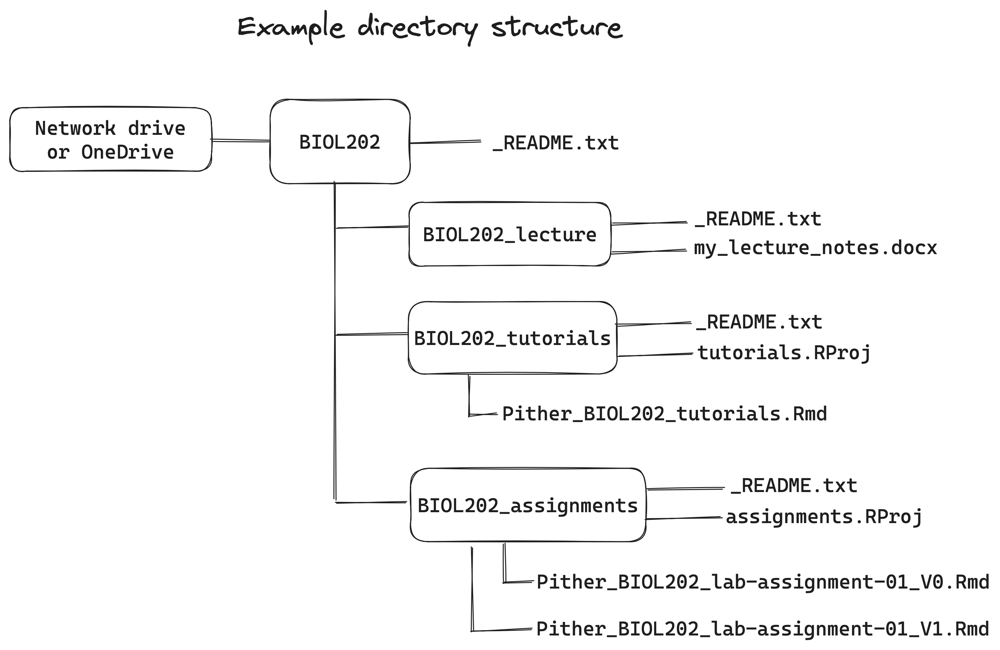

# Reproducible Research {#repro_research}

```{r echo = FALSE}
knitr::opts_chunk$set(echo = TRUE)
options(knitr.table.format = "html")
```

A key goal of our Biology program at UBC's Okanagan campus is to foster appreciation for reproducible research, and to equip students (and professors) with skills that will help them undertake reproducible research themselves.     

In first year you may have learned from the Biology program's [introductory Open Science learning modules](https://ubco-biology.github.io/OS-Introduction/) that reproducible research studies are not as common as one might assume. (If you did not cover that material, do so now). One key reason for this is insufficient documentation of all the steps taken along the research workflow.  Moreover, conducting reproducible research is extremely challenging - more than most scientists appreciate. See, for example, an incredible, recent case concerning ageing experiments with *C. elegans* [here](https://www.nature.com/news/a-long-journey-to-reproducible-results-1.22478).

In the BIOL202 lectures you'll learn more about the various causes of irreproducible research, and about the practices that can help promote reproducibility. In this lab component of the course, you'll learn the basics of how to achieve an acceptable level of *computational reproducibility* (complete computational reproducibility is actually pretty tricky, but we'll get close).

**Learning Outcomes** 

Upon successful completion, students will be able to:  
1.	Implement a computationally reproducible workflow using R, RStudio, and R Markdown  
2.	Organize and manage data and project files using versioned, structured formats  
3.	Create clean, analysis-ready datasets in .csv or .rds formats  
4.	Use R Markdown to document and explain all analysis steps and results  

## Computational reproducibility {#comp_repro}

Almost all research, whether it's conducted in the field or in a lab, includes a substantial amount of work that's done on the computer. This includes data processing, <a href="https://ubco-biology.github.io/Procedures-and-Guidelines/glossary#Statistical-analysis">statistical analyses</a>, data visualization and presentation, and production of research outputs (e.g. publications).  Some research is of course exclusively conducted on computers.  The bottom line is that computer-based work forms a key and substantive part of all research workflows.  

Given that this work is done on computers (which are entirely controllable), it should be able to be reproduced **exactly**.  This is known as **computational reproducibility**: an independent researcher should be able to access all data and scripts from a study, run those scripts, and get exactly the same outputs and results as reported in the original study.  

In this tutorial you'll start gaining relevant experience and skills by producing a reproducible lab report.   

::: {.callout-note}
A *workflow* refers to the the steps you take when conducting your day-to-day work - say, on a term project, for example. Having a well-designed workflow improves efficiency, and when done right, reproducibility. It includes, for example, how you create, access, and manage files on your computer (or in the cloud).
:::

Following best practices for naming and organizing your files and directories on your computer will help ensure that you can spend more time doing the important work, and less time fiddling and trying to remember what you did and where you saved your work. It will also help your future self, when labs and assignments in upper year courses request that you use <a href="https://ubco-biology.github.io/Procedures-and-Guidelines/glossary#R">R</a> and R Markdown for analyses and reports.

::: {.callout-caution title="Activity"}
Review the Biology department's [Procedures and Guidelines webpage](https://ubco-biology.github.io/Procedures-and-Guidelines/) description of how to [manage files and directories](https://ubco-biology.github.io/Procedures-and-Guidelines/file-and-data-management.html). This should take about **20 minutes**.
:::

## An example BIOL202 workflow {#biol202_workflow}

Now that you have reviewed the fundamentals of <a href="https://ubco-biology.github.io/Procedures-and-Guidelines/glossary#File-and-data-management">file and directory management</a>, you should decide how to best organize and manage the work you do for BIOL202. Here we'll provide one example approach that most if not all of you will find useful.  

## Microsoft OneDrive {#onedrive}

Our suggested approach assumes you have set up a Microsoft account through UBC (using your CWL), and have set up the OneDrive application on your own computer, which automatically syncs (when you're online) selected files/directories between your local computer and your OneDrive account in the cloud.

Why OneDrive? As a UBC student, you receive 1TB of free storage! And you also get peace of mind knowing that your files are secure and up-to-date (provided you have an internet connection), and that OneDrive has something called <a href="https://ubco-biology.github.io/Procedures-and-Guidelines/glossary#Version-control">"version control"</a>, which saves old versions of files and allows you to see those versions if you wish, **so long as you maintain the same file name**. 

::: {.callout-note}
**WAIT A SECOND!** In the ["File Naming"](https://ubco-biology.github.io/Procedures-and-Guidelines/file-naming.html) instructions that I just reviewed, I was instructed to create a new file with a new version number in the filename (e.g. with a "V0", "V1", "V2" etc...) each time I worked on it!  
:::

Those instructions are entirely valid! However, when you have access to a *version control* system, like OneDrive, it is better to **keep the file name the same**, rather than changing it each time you update it. For example, your markdown file (which as a ".Rmd" extension to the name) that you use for your tutorial work should maintain the same name throughout the term, rather than saving a new file each time you do substantive work on it. 

Assuming your files are syncing properly between your computer and OneDrive (and this simply requires that you're connected to the internet), you will always be able to [see (and if desired, restore) old versions of your files](https://support.microsoft.com/en-us/office/restore-a-previous-version-of-a-file-stored-in-onedrive-159cad6d-d76e-4981-88ef-de6e96c93893). 

If you haven't set up OneDrive yet, follow the instructions provided at this [UBC IT website](https://lthub.ubc.ca/guides/microsoft-onedrive-student-guide/).

::: {.callout-note}
Using OneDrive is entirely optional.  If you choose not to use OneDrive, please follow the file naming instructions from the [Procedures and Guidelines document](https://ubco-biology.github.io/Procedures-and-Guidelines/file-naming.html). And you can still follow the directory structure instructions below, regardless of where you set up your directories (OneDrive or not).
:::

## Directory structure {#dir_structure}

We anticipate three general categories of work being undertaken:  

* Lecture work, including annotating lecture notes (e.g. on PDFs or PowerPoints) and writing study notes of your own (e.g. using Word)
* Tutorial work, including practicing what you learn in tutorials using RStudio and R Markdown, and commenting about tips, or tricky bits 
* Lab assignment work, in which you answer questions using R and R Markdown and create a document for submission and grading

Each of these categories of work should have their own directory, and all three of these directories should exist within a "root" directory called "BIOL202".  

## Steps to set up directories {#setup_dirs}

* Having successfully installed OneDrive, you should see a "OneDrive" folder on your computer
* In your OneDrive folder, create a root directory "BIOL202" to host all of your BIOL202 work
* Create a "_README.txt file for the root BIOL202 directory, as per instructions in the [Biology Procedures and Guidelines webpage](https://ubco-biology.github.io/Procedures-and-Guidelines/readme-files-and-data-dictionaries.html).

::: {.callout-note}
You can create and edit your "_README.txt" file in RStudio! Just click on the "+" drop down at the top left, and select "Text file". Then type in the information you need, and name it "_README.txt" and save it in the appropriate directory.
:::

* Within the BIOL202 root directory, create three (sub)directories: 
  - "BIOL202_lecture"
  - "BIOL202_tutorials"
  - "BIOL202_assignments"
* Create a "_README.txt" file in each of the three sub-directories (again, you can use RStudio to create these!). 

An example setup is illustrated below.

```{r, fig.cap = "Example directory structure", echo = FALSE, fig.width = 3}

```

The BIOL202 directory, and all its contents, will now sync regularly to your online OneDrive account, so that you can access your up-to-date files from any device upon which OneDrive is installed.

It is possible to work on files stored on your local computer when you're offline; they just won't sync to the cloud until you've gotten back online. 

## Lecture workflow {#lecture_workflow}

The directory for your lecture work is now ready to house any lecture-related work that you do. For instance, if you wish to type up study notes in a Word document, you could call that file "Pither_BIOL202_lecture-notes.docx".  Each time you add/edit/update it, OneDrive will keep old versions for you!

## Tutorial workflow {#tutorial_workflow}

How you manage your tutorial workflow comes down to personal preference. The instructions provided below create an RStudio project in the "BIOL202_tutorials" directory (see below), and then create a single R Markdown document, formatted to have sections (headers) for each tutorial you work on.  This approach makes it easier to find all of your work in the R Markdown file, so long as it is formatted logically.  
I have created an R Markdown file that you can download and use for this purpose, and we'll download that a bit later. 

First, we need to set up an RStudio project. 

## Create an RStudio Project {#create_project} 

It is best to organize all your R work using RStudio "projects".  For your tutorial work, for example, you will create a new project that will be housed in your "BIOL202_tutorials" directory

To do this, open RStudio then select File > New Project. Then select the option to use an existing directory, and locate and select your tutorial directory. Provide a name for your project file, such as "BIOL202_tutorial", then select OK. If it asks to open a new RStudio session, you can say yes.

RStudio has now created an RStudio project file that has an "Rproj" extension at the end of the name. This "Rproj" file is the file that you will open (double-click with the mouse) each time you wish to work on your tutorial material.  You should  see the "Rproj" file in the bottom right files panel of RStudio.

## Create subdirectories {#create_subdirs}

Your tutorial work may involve creating and saving outputs like figures or files, in which case you should have sub-directories for these purposes in your root directory. See the example provided in the [Procedures and Guidelines document](https://ubco-biology.github.io/Procedures-and-Guidelines/example-biol-116.html#screenshot).

Let's illustrate the procedure by creating a subdirectory called "figures", and this time we'll use R to create the directory.

The following code will create a directory called "figures" in your working directory

```
dir.create("figures")
```

You should see the new folder appear in the files panel on the bottom right of RStudio.

Whenever you wish to generate figures in R, then export them as image files, for example, you can save them to this folder.  We'll learn about this later.

Reading and writing files from / to directories requires that we can tell R exactly where to find those directories.  That's where the handy package called `here` comes in. 

### The `here` package{#here_package}

Now we'll install and load an R package called `here` that will help with file and directory management and navigation. 

```
install.packages("here")
```

This is a helpful [vignette](https://here.r-lib.org/index.html) about the `here` package.

Then we load the package:

```{r, eval = F}
library(here)
```

When you load the package, the `here` function takes stock of where your RStudio project file is located, and establishes that directory as the "working directory". It should return a file path for you. In future tutorials we'll make use of the `here` package when saving files.  

## Edit an R markdown file {#edit_markdown}

In a previous [tutorial](01-getting-started.qmd#intro_markdown) you learned how to create an R Markdown file, but generally you won't need to do this in this course, because you'll be provided starter documents to work with.

I have created an R Markdown file that you can download and use for starting your tutorial work. 

To do this, type the following code into your command console in RStudio (the bottom left panel):

```{r down_rmd, eval = F}
download.file("https://raw.githubusercontent.com/ubco-biology/BIOL202-lab-tutorials/main/templates/Example_tutorial_markdown.Rmd", "BIOL202_tutorial_markdown.Rmd")
```

This `download.file` command takes a URL address for a file stored online, and then tells R where to save it, and what name to use. 

Here we will save the RMD file in your "working directory", which is the "BIOL202_tutorials" directory. It should show up in the "files" pane in the bottom right RStudio panel.  Click on the "BIOL202_tutorial_markdown.Rmd file to open it.

This is the R Markdown file that you'll edit/add to throughout the term.  It has some starting instructions / example text already, and you're welcome to delete / change that.  

* Change the "author" information at the top of the document (in the header) to your name.
* Save your file by clicking the save icon in the top left, and be sure to give it an appropriate name as per previous file-naming instructions

For the basics on formatting in R Markdown, consult the R Markdown [reference guide ](https://utstat.utoronto.ca/reid/sta2201s/rmarkdown-reference.pdf)

## Components of an R Markdown file {#md_components}

At this point, you should familiarize yourself with the components of a markdown file.  

::: {.callout-caution title="Activity"}
**R Markdown basics**: Read through section 4.2 of this online [tutorial](https://rbasics.netlify.app/4-rmarkdown.html#the-components-of-an-r-markdown-file) and watch the videos there too.
:::

* * *

## Interacting with Tutorial material {#interact_tutorial}

Students have typically worked through tutorials by reading the material, typing helpful notes in their markdown document, and typing the provided R code into "chunks" within their R Markdown document, then running those chunks.  (**NOTE**: it's better for you to practice typing the code, rather than copying and pasting!)

You can insert as many chunks as you'd like. Chunk insertion is achieved by selecting the green "+" icon at top of the editor panel, and selecting "R".  Or go to the "Code" menu drop down and "Insert Chunk".

The key advice: keep your work organized by using headings. There's an option to view your headings all in one navigation pane by clicking on the navigation pane icon at the top right of your editor panel. 

## Lab assignments workflow {#assign_workflow}

You can repeat the same steps from earlier for creating a new [RStudio project](#create_project) for your lab work. But this time when you create the project, specify your lab assignment directory "BIOL202_assignments" as the location.  

You can optionally create subdirectories also, perhaps one for each of the lab assignments. 

The key difference in the assignments workflow is that for each assignment you'll start with a new R Markdown (Rmd) file, which you'll download from Canvas under the "assignments" link.  The document will include the questions you are to answer, and you simply edit / add to the document as you answer them.

Instructions for this will come in a later tutorial.  

Next tutorial: Practicing completing a very short lab assignment using R Markdown.


