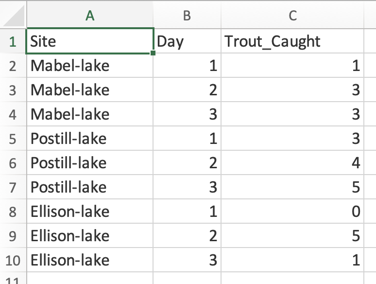
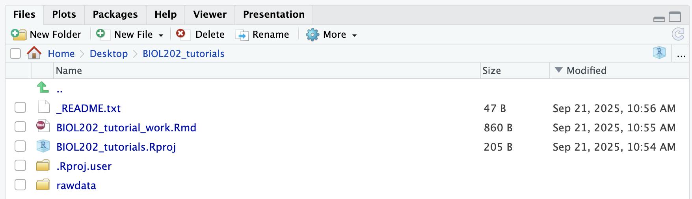

# Preparing and importing Tidy Data {#data_import}

**Tutorial learning objectives**

In this tutorial you will:  

* Review how to format your data 
  + [Tidy data](https://ubco-biology.github.io/Procedures-and-Guidelines/tidy-data.html)
  + Do's and Don'ts of naming variables and data entry
  + <a href="https://ubco-biology.github.io/Procedures-and-Guidelines/glossary#Wide-format-data">Wide</a> versus <a href="https://ubco-biology.github.io/Procedures-and-Guidelines/glossary#Long-format-data">Long</a> format
* Learn how to save a file in CSV (comma-separated values) format  
* Learn how to import a CSV file from a website into a `tibble` in R  
* Learn how to import a CSV file from a local directory into a `tibble` in R  
* Learn how to get an overview of the data and variables in your `tibble`

Importing data should be a straightforward task, but this is not always the case; sometimes data files are not formatted properly, so you need to be careful to check what you import.  

Here, you'll learn (or review) how to format your own data files according to best practices, so that you or others will have no problems importing them.  

It is assumed that if you are collecting data during a project, you'll likely enter them on your computer using a spreadsheet software program like Excel. 

::: {.callout-note}
**PAUSE**:  Before starting any data collection and data-entry, ask yourself: how should I organize the spreadsheet for data-entry?
:::

The short answer: according to **TIDY** formatting principles...

## Tidy data {#tidy_data}

Review the [Biology Procedures and Guidelines document](https://ubco-biology.github.io/Procedures-and-Guidelines/tidy-data.html) chapter on **Tidy data**.

There you'll learn how to arrange and format your data within a spreadsheet. The "Tidy" example provided would look like this in Excel: 

```{r fig-04-tidy-data-excel, fig.cap = "Tidy data in Excel", echo = FALSE, fig.width = 3}

```


::: {.callout-tip collapse="true"}
If you'd like a longer, more in-depth read about "tidy data", see Hadley Wickham's "R for Datascience" online book, linked [here](http://r4ds.had.co.nz/tidy-data.html). 
:::

If you wish to import and analyze data that have not been formatted according to **tidy** principles, then the most transparent and computationally reproducible way to reformat the data is to do so by coding _within R_, rather than using software like Excel.  The process of reformatting / rearranging data is called **data wrangling**, and is mostly beyond the scope of this course. 

If you're curious about data wrangling, the `dplyr` package provides all the tools for data wrangling. Its associated cheatsheet is available at the package's [vignette website](https://dplyr.tidyverse.org/index.html).

## Import a CSV file from a website {#import_csv_url}

In previous tutorials we've already seen how to import <a href="https://ubco-biology.github.io/Procedures-and-Guidelines/glossary#Comma-separated-values-(CSV)-file">CSV files</a> from the web. As always, the first step is to load the packages we need. `readr` supplies the import functions, and `dplyr` and `ggplot2` supply the wrangling and plotting tools we use later in this tutorial.

```{r}
library(dplyr)
library(ggplot2)
library(readr)
```

The `readr` package includes the handy `read_csv` function.

You can view the help file for the `read_csv` function by typing this into your command console pane (bottom left) in RStudio:

```
?read_csv
```

You'll see that the function has many optional "arguments", but in general we can use the default values for these.

::: {.callout-note}
## Why learn this, when the course data come in a package?

For the course's own datasets you can just use `data(students)`, and most tutorials do exactly that. But the data *you* collect will not arrive in an R package — it will be a CSV file you made. Importing a CSV is therefore a core skill, and this tutorial is where you learn it.

Here we use a copy of the course data hosted online so you can practice the real thing.
:::

If the file you wish to import is located on the web, then we need to provide the "URL" (the web address) to the `read_csv` function, in double quotation marks:

```{r import_students_url}
students <- read_csv("https://raw.githubusercontent.com/ubco-biology/BIOL202-lab-tutorials/main/csv_data/students.csv")
```

::: {.callout-warning}
**PAUSE**: Did you get an error like this?

**Error in read_csv(...) : could not find function "read_csv"**

This happens if you forgot to load the `readr` package!
:::

The default behaviour of the `read_csv` function is to include a printout of the type of variable housed in each column of the dataset. For example, when importing the `students` dataset, the function gives a printout showing that there are three "character" variables (denoted `chr`) — R reads categorical variables in from a CSV as character variables — and three `dbl`, or double precision, floating point format numeric variables.

::: {.callout-caution title="Activity"}
Take a minute to check out this [good overview](https://www.burns-stat.com/documents/tutorials/impatient-r/more-r-key-objects/more-r-numbers/) of how R handles numeric variables.
:::

You can tell R to not provide this information by including the argument `show_col_types = FALSE` within the `read_csv` code.  Like so:

```{r readcsv_noshow}
students <- read_csv("https://raw.githubusercontent.com/ubco-biology/BIOL202-lab-tutorials/main/csv_data/students.csv",
                     show_col_types = FALSE)
```

We have now imported the data and stored it in a local object called "students". The object is called a "tibble", which you can think of as a special kind of spreadsheet. More information on "tibbles" can be found [here](https://r4ds.had.co.nz/tibbles.html).

::: {.callout-note}
The CSV copies of the course datasets are all stored at the same URL location, specifically: "https://raw.githubusercontent.com/ubco-biology/BIOL202-lab-tutorials/main/csv_data/". (**note** that clicking on this URL will not load a website). To import any of them, copy that path and append the file name. For example, the full path to the `birds.csv` file would be "https://raw.githubusercontent.com/ubco-biology/BIOL202-lab-tutorials/main/csv_data/birds.csv".

These CSVs exist so you can practice importing. In the tutorials that follow, we use `data(birds)` instead, which is simpler and does not need an internet connection.
:::

::: {.callout-important}
## Character versus factor

Notice that `read_csv` gives you **character** variables for the categorical columns, whereas `data(students)` gives you **factor** variables. A factor is R's type for a categorical variable with a known, fixed set of categories, and it remembers the *order* of those categories — which matters later, when we compare group means.

The datasets in the `biol202` package have already been converted to factors for you, with sensible category orders. When you import your own CSV, that conversion is a step you do yourself.
:::

Often you'll need to import data from a locally stored CSV file, rather than from the web. You'll learn how to do this [shortly](#import_csv_local).  First: how does one create a CSV file?

## Create a CSV file {#create_csv_local}

Before we create or save any data files on our local computer, we should first create a directory (folder) called "rawdata" to store them.

Let's create the new directory in our "BIOL202_tutorials" working directory.  To do this, use the `dir.create` function in R, as follows:

```{r, eval = FALSE}
dir.create("rawdata")
```

Once you run this code, you'll see the new directory appear in the Files pane in the bottom-right of RStudio. It might look something like this:

```{r fig-04-view-files-rawdata-folder, fig.cap = "View of files with rawdata folder", echo = FALSE, fig.width = 3}

```

::: {.callout-note}
The folder is called "rawdata" because the data stored there will be the unedited, raw version of the data, and any files therein should **NOT** be altered.  Any changes or edits one makes to the datasets should be saved in new data files that are saved in a different folder called "output", which we'll create later.
:::

Let's create a data file to work with.

**Steps to create and save a CSV file**

* Open up Excel or any other spreadsheet software and enter values in the spreadsheet cells exactly as shown in the Excel example in Figure 5.1 from the [Tidy Data section above](#tidy_data)
* You should have one row with the 3 variable names ("Site", "Day", "trout_caught"), one in each column, then nine rows of data
* Save the file as a CSV file by selecting (MAC) File > Save As > and in the drop down list: CSV UTF-8 (Comma separated), and Windows File > Save as type > CSV UTF-8 (comma separated)
* Name it "trout.csv", and save it within the newly created "rawdata" folder

Now we're ready to try importing the data into a "tibble".

## Import a local CSV file {#import_csv_local}

You can find additional help on importing different types of files at the [Data Import Vignette](https://rstudio.github.io/cheatsheets/html/data-import.html), which includes a cheatsheet.

**Steps to import a local CSV file**

We'll use the "trout.csv" file that we created previously. 

And we'll make use of the `here` package that we were introduced to in an [earlier tutorial](02-reproducible-r.qmd#here_package).  

Let's load the package:

```{r, message = FALSE}
library(here)
```

::: {.callout-note}
**New tool**: Pipes or "%>%" are implemented in the `magrittr` package, which `dplyr` loads for you. In brief, pipes allow us to string together a series of functions, and we'll use them frequently in tutorials.
:::

Here we'll use a pipe to help import the data file.

Let's see the code first, then explain after: 

```{r, eval = FALSE}
trout <- here("rawdata", "trout.csv") %>%
  read_csv()
```

```{r, echo = FALSE, message = FALSE}
# Students run the chunk above, which reads the trout.csv file they created
# themselves in their own rawdata/ folder. That file does not exist when this
# book is rendered, so we load the same data from the package instead. The
# result is identical -- this only keeps the rendered output honest.
library(biol202)
data(trout)
```

* First we have the name of the object (a "tibble") that we wish to create, "trout". 
* Then you see the assignment operator "<-", which tells R to assign whatever we're doing to the right of the operator to the object "trout".
* Then we have the `here` function, which is taking two inputs: the name of the directory we wish to get something from ("rawdata"), and then the name of the file we wish to do something with, here "trout.csv"). 
* Then we have a pipe "%>%", which tells R that we're not done coding yet - there's more to come on the next line...
* Lastly, we use the `read_csv` function, whatever came before the pipe is what is fed to the `read_csv` function.

Go ahead and run the chunk of code above to create the "trout" object.  

Next we'll learn how to get an overview of the data stored in a tibble object.

## Get an overview of a dataset {#data_overview}

When you import data it is always a good idea to immediately get an overview of the data.  

Key questions you want to be able to answer are:

* How many variables (columns) are there in the dataset?
* How many observations (rows) are in the dataset?  
* Are there variables whose data are categorical? If so, which ones?
* Are there variables whose data are numerical? If so, which ones?
* Are there observations missing anywhere?

As we learned in the "Preparing and formatting assignments" [tutorial](03-formatting-assignments.qmd#example_answer), the `skimr` package has a handy function called `skim_without_charts` that provides a good overview of a data object. This is a rather long function name, and in fact the main function is called `skim`. However, by default, `skim` includes small charts in its output, and we don't want that presently, hence the use of `skim_without_charts`.

Let's load that package now:

```{r}
library(skimr)
```

And get an overview of the `trout` dataset, again using the pipe approach: 

```{r, eval = TRUE}
trout %>%
  skim_without_charts()
```

A lot of information is provided in this summary output, so let's go through it:

* The Data Summary shows the name of the object, the number of rows, and the number of columns
* Column type frequency shows how many columns (variables) are of type "character", which is equivalent to "categorical", and how many are "numeric"
* Group variables shows if there are any variables that are specified as "grouping" variables, something we don't cover yet.
* Then it provides summaries of each of the variables, starting with the character or categorical variables, followed by the numeric variables
* Each summary includes a variety of descriptors, described next
* The "n_missing" descriptor tells you how many observations are missing in the given variable. In the "trout" dataset we don't have any missing values
* The "n_unique" descriptor for categorical variables indicates how many unique values (categories) are in that variable; for the "Site" variable in the "trout" dataset there are 3 unique values
* The descriptors for the numeric variables include the <a href="https://ubco-biology.github.io/Procedures-and-Guidelines/glossary#Mean">mean</a>, <a href="https://ubco-biology.github.io/Procedures-and-Guidelines/glossary#Standard-deviation">standard deviation (sd)</a>, and the quantiles

Now you have what you need to answer each of the questions listed above!

One additional function that is useful during the overview stage is `head`. This function just gives you a view of the first 6 rows of the dataset:

```{r}
# we can use head(trout), or the pipe approach: 
trout %>%
  head()
```

When you use `head` on a "tibble", like we have here, it outputs another "tibble", in this case 6 rows by 3 columns. But recall that the full "trout" dataset includes 9 rows and 3 columns.

## Tutorial practice activities

This activity will help reinforce each of the key learning outcomes from this tutorial.

**Steps**

You are going to take measurements of the lengths (in mm) of your thumb, index finger, and middle finger on each hand; but don't start measuring yet! 

First:

* Create a new R Markdown document for this practice activity. This is where you'll record the procedures you use for this practice activity
* As we've learned in previous tutorials, one of the first steps we should do is include a code chunk in the markdown document in which we load any packages we'll need. 
* Include a code chunk to load the packages used in the present tutorial
* Save the R Markdown document in your root "BIOL202_tutorials" directory, and provide it an appropriate file name.
* Open a new blank spreadsheet in Excel

::: {.callout-note}
Before taking the measurements, think about how you can make your measurement procedure reproducible. Where exactly are you measuring from and to on each digit?  Are you using a ruler?  What's your measurement precision? Whatever approach you take, make sure you type it out clearly in your R Markdown document, so that someone else could repeat it.
:::

* Also before you start measuring, think about how you'll organize the data in the spreadsheet, including how many variables you'll have, what to name those variables, and how many rows or observations you'll have.  

**HINT**: Even before you start measuring, most of your data sheet should be filled with values, and when you type in your 6 measurements, these should be entered in a single column.

* Once you've organized the spreadsheet, and even before you start entering the digit measurements, save it as a CSV file into your <a href="https://ubco-biology.github.io/Procedures-and-Guidelines/glossary#Raw-data">"rawdata"</a> folder, remembering to use an appropriate file name
* Once you've typed out the methods in your markdown document, you can start taking measurements and recording them in the spreadsheet
* Once you've finished entering the data, save the spreadsheet again, then quit Excel.

::: {.callout-note}
Now would be a good time to create and edit a "_README.txt" [file](02-reproducible-r.qmd#setup_dirs) for your new "rawdata" folder. 
:::

Now you're ready to import the data into R.

* In your R Markdown document, include a code chunk to import the data.

Now you're ready to get an overview of the data.

* In your R Markdown document, include a code chunk to get an overview of the dataset.

Once you've confirmed that each of the code chunks work in your R Markdown document, you're ready to knit!

* Knit your document to PDF.

All done!

